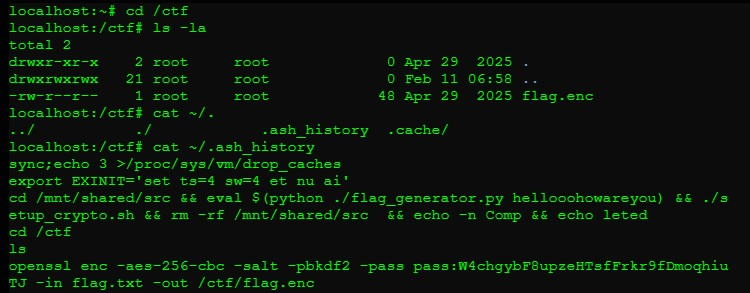
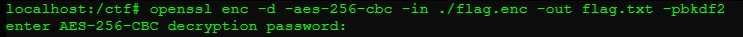
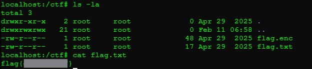

## CRY-0: Cryptanalysis
**Description:**
A basic cryptanalysis challenge that involves decrypting an AES-encrypted file using information leaked in historical terminal commands.
<details> <summary><b>Reveal Hidden Flag</b></summary> flag{eda7be446f} </details></br>

**Solution Summary:**
- Discovered an encrypted file `flag.enc` in the `/ctf` directory.
- Retrieved the password and encryption parameters from `.ash_history`.
- Decrypted the file using OpenSSL to reveal the flag.

**Exploitation Steps:**
1. Navigate to the `/ctf` directory and identify the encrypted file:
   ```bash
   cd /ctf && ls
   ```

2. View historical terminal commands to find encryption parameters and password:
    ```bash
    cat ~/.ash_history
    ```
    Found the pass that used to create the `flag.enc` file:
    ```plaintext
    openssl enc -aes-256-cbc -salt -pbkdf2 -pass pass:W4chgybF8upzeHTsfFrkr9fDmoqhiuTJ -in flag.txt -out /ctf/flag.enc
    ```
    

3. Decrypt the flag using OpenSSL and the pass from above when prompted:
    ```bash
    openssl enc -d -aes-256-cbc -in ./flag.enc -out flag.txt -pbkdf2
    ```
    

4. View the contents of the decrypted file:
    ```bash
    cat flag.txt
    ```
    