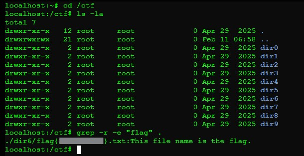

## MISC-0: Information Gathering
**Description:**  
A basic reconnaissance task to identify the location and content of the flag within the file system.
<details> <summary><b>Reveal Hidden Flag</b></summary>
flag{2cf24dba5f}
</details></br>

**Solution Summary:**
- Navigated to the `/ctf` directory.
- Searched recursively for the keyword `flag` across all files.
  
**Exploitation Steps:**
1. Change into the CTF directory:
   ```bash
   cd /ctf

2. Run a recursive grep to search for the keyword "flag":
   ```bash
   grep -r -e "flag" .
   ```
   