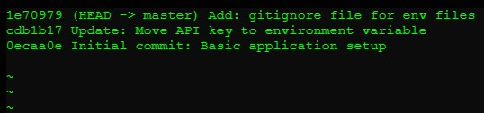

## MISC-1: Trace Investigation
**Description:**  
This challenge involved analyzing a user’s shell history to reverse-engineer how a flag was programmatically generated from a seeded value.
<details> <summary><b>Reveal Hidden Flag</b></summary>
flag{b57ab06d11}
</details></br>

**Solution Summary:**
- Discovered a .git directory in the challenge directory.
- Used git log to find a commit where the API key (flag) was removed.
- Checked out earlier commits and found the flag hardcoded.
- Demonstrated Git as a source of leaked secrets in improperly managed repos.

**Exploitation Steps:**
1. Identified .git directory
   Upon exploring the /ctf/secure-app/ folder, I discovered a .git/ directory — confirming the app was managed under Git.
   ```bash
   cd /ctf/secure-app/
   git log
   ```
   **Found three commits:**  
   The second commit clearly hinted that an API key was originally hardcoded and then moved into an environment variable — a typical scenario for secret leakage in Git history.
   

2. I checked out the initial commit, before the API key was removed:
   ```bash
   git checkout 0ecaa0e #Initial commit: Basic application setup
   ```
   

3. Then searched the codebase for sensitive values:
   ```bash
   grep -r 'flag{' .
   ```
    

4. Alternatively, you can confirm the key removal by comparing commits:
   ```bash
   git diff 0ecaa0e cdb1b17
   ```
   \
   _This shows the line where the API key was removed._

---
\
🔐 **Alternate Path (Originally Unintended & Now Patched — For Reference Only)**

1. Initial Discovery via Shell History:\
The challenge allowed access to the user's `.ash_history`, which revealed how the flag was generated:
   ```bash
   cat ~/.ash_history
   ```
   Snippet from `~/.ash_history`:
      ```plaintext
      chmod +x /mnt/shared/src/gen_task.sh && /mnt/shared/src/gen_task.sh hellowhoareyou && echo -n Comp && echo leted
      ```
   🧠 _This exposed the use of a script with a seeded input (**hellowhoareyou**) — a key insight for reverse-engineering the flag._

2. Unintended Access to Internal Script

   The file `/mnt/shared/src/gen_task.sh` was **not meant to be accessible by participants**, but was available at the time.

   Its contents revealed:
      ```bash
      flag=$(echo -n "$seed" | sha256sum | awk '{print substr($1, 1, **REDACTED**)}')
      ```
   📌 _This disclosed the flag-generation logic using a SHA256 hash of the seed._

3. Reproducing the Flag Using the seed from `.ash_history`:
      ```bash
      echo -n "hellowhoareyou" | sha256sum | awk '{print substr($1, 1, **REDACTED**)}'
      ```
      Output:
      ```plaintext
      b57**REDACTED**
      ```
4. Finalise flag by wrapping it:
      ```plaintext
      flag{b57**REDACTED**}
      ```