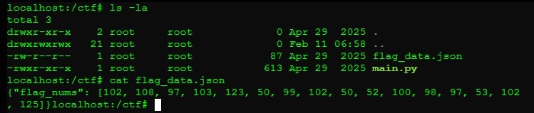

## REV-0: Reverse Engineering
**Description:**  
A light reverse engineering task involving decoding an array of integers to reconstruct the flag.
<details><summary><b>Reveal Hidden Flag</b></summary>
flag{2cf24dba5f}
</details></br>

**Solution Summary:**
- Located an integer array stored in `flag_data.json` under `/ctf`.
- Converted the integer values to ASCII characters using a custom Python script.

**Exploitation Steps:**

1. Located and reviewed two files under `/ctf`: `main.py` and `flag_data.json`.

2. Found the encoded flag in `flag_data.json` in the form of an integer array:
   

3. Wrote a Python script to decode the integers into ASCII characters:
   ```python
   #!/usr/bin/python3

   flag_nums = [102, 108, 97, 103, 123, 50, 99, 102, 50, 52, 100, 98, 97, 53, 102, 125]
   flag = ""
   for i in flag_nums:
       flag += chr(i)

   print(flag)