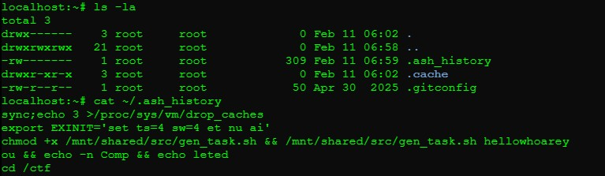

## MISC-1: Trace Investigation
**Description:**
This challenge involved analyzing a user’s shell history to reverse-engineer how a flag was programmatically generated from a seeded value.
<details> <summary><b>Reveal Hidden Flag</b></summary> flag{b57ab06d11} </details></br>

**Solution Summary:**
- Identified a reference to a script and its execution within `.ash_history`.
- Located the parameter used to generate the flag.
- Reconstructed the hash-based generation logic to reveal the flag.

**Exploitation Steps:**
1. Viewed the `.ash_history` file to find a reference to script execution:
   ```bash
   cat ~/.ash_history
   ```
   Found entry:
   ```plaintext
   chmod +x /mnt/shared/src/gen_task.sh && /mnt/shared/src/gen_task.sh hellowhoareyou && echo -n Comp && echo leted
   ```
   
   
2. Identified hellowhoareyou as the argument passed into the script.

3. Analyzing the script logic for the `app.py` and `config.py` scripts I found the following flag generation method:
   ```bash
   flag=$(echo -n "$seed" | sha256sum | awk '{print substr($1, 1, 10)}')
   ```

4. Replaced `$seed` with `hellowhoareyou` found in step two from `~/.ash_history`:
   ```bash
   echo -n "hellowhoareyou" | sha256sum | awk '{print substr($1, 1, 10)}'
   ```
   Output:
   ```plaintext
   b57**REDACTED** 
   ```
   

5. Complete flag by adding the wrapper and submitting:
   ```plaintext
   flag{b57**REDACTED**}
   ```