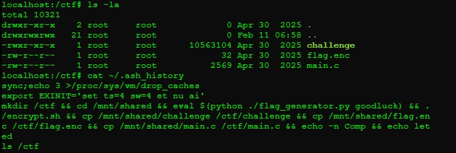
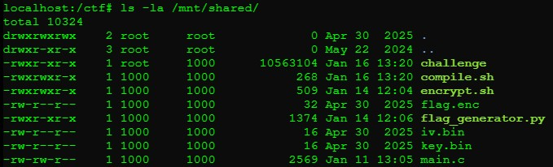
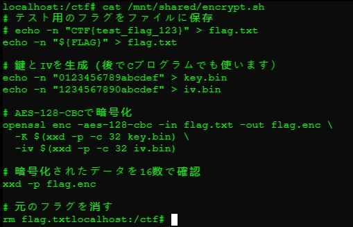
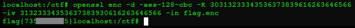

## REV-1: Flag Authentication
**Description:**  
This challenge involved decrypting a file using a known encryption algorithm along with the provided key and IV values.
<details><summary><b>Reveal Hidden Flag</b></summary>
flag{735701f285}
</details></br>

**Solution Summary:**
- Discovered that the encryption algorithm used was AES-128-CBC.
- Retrieved the key and IV from the system in plaintext form.
- Used OpenSSL to manually decrypt the encrypted flag file.

**Exploitation Steps:**
1. Enumerated the terminal and found challenge files under `/ctf`, as well as something noteworthy in `.ash_history`:
   

2. Investigated further and found the `/mnt/shared/` directory contained the encryption-related files:
   

3. Extracted plaintext values from `iv.bin` and `key.bin`:
   - Key: `1234567890abcdef`
   - IV: `0123456789abcdef`

   _These appear to have been directly used as encryption parameters for AES._

4. Examined the `encrypt.sh` script in the same directory, which showed how `flag.txt` (now removed) was encrypted into `flag.enc`:

   

   The script used `openssl enc` with `xxd` to convert the binary key and IV to hex:
   ```bash
   openssl enc -aes-128-cbc -in flag.txt -out flag.enc \
     -K $(xxd -p key.bin) \
     -iv $(xxd -p iv.bin)
   ```
   _This provided a clear blueprint to reverse the encryption process._

5. Used the recovered key and IV to manually decrypt flag.enc using OpenSSL:
   ```bash
   openssl enc -d -aes-128-cbc \
   -K 30313233343536373839616263646566 \
   -iv 31323334353637383930616263646566 \
   -in flag.enc
   ```
   **Note:** The key and IV must be converted from ASCII to hexadecimal before being passed to OpenSSL.

6. The command successfully decrypted the file and revealed the plaintext flag:
   