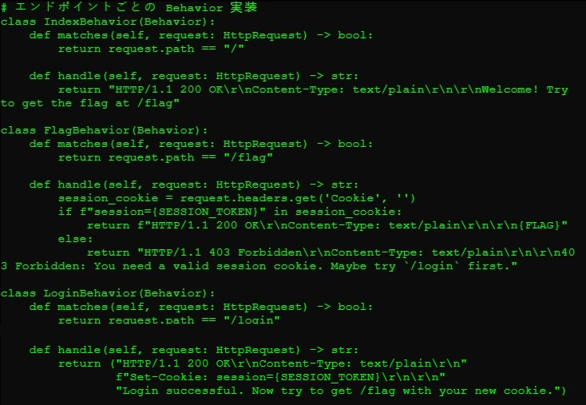
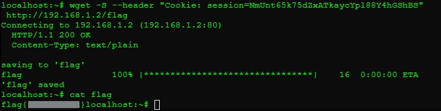

## WEB-0: Session Analysis
**Description:**  
This challenge involved analyzing a web application's session handling mechanism to retrieve a flag protected by cookie-based authentication.
<details> <summary><b>Reveal Flag</b></summary>
flag{5b3110c1dd}
</details></br>

**Solution Summary:**
- Identified that the `/flag` endpoint required a valid session cookie.
- Retrieved a session token from the `/login` endpoint.
- Used the token to access the protected `/flag` route and extract the flag.

**Exploitation Steps:**
1. Explored the `/ctf` directory and reviewed the source code:
   ```bash
   ls /ctf
   cat client.py
   cat server.py
    ```
2. Analyzed the behavior of server.py and identified that the /flag route checks for a session cookie before granting access. Further review showed that the /login route generates and returns the required session token.
    

3. Using `wget` sent a request to `/login` to obtain a valid session:
    ```bash
    wget -S http://192.168.1.2/login
    ```
    Output included the following `Set-Cookie`:
    ```plaintext
    Set-Cookie: session=NmUnt65k75dZxATkaycYpl88Y4hGShBS
    ```
4. Sent a follow-up request to `/flag` using the retrieved session cookie:
    ```bash
    wget -S --header "Cookie: session=NmUnt65k75dZxATkaycYpl88Y4hGShBS" http://192.168.1.2/flag
    ```
    The response contained the flag:
    

